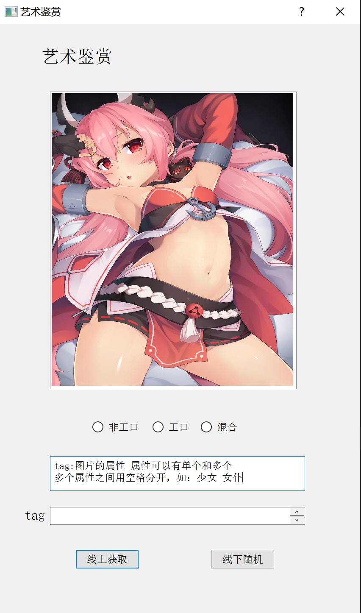

## 记录自己写的一些python小玩意

#### MySocket
> 实现简单的TCP和UDP服务器，以及客户端的请求

#### Decorator
> 简单的AOP编程实例：一类函数的异常日志写入

#### FileReader
> 封装了简单的文件读取函数

#### DjangoTutorial
> 跟着Django官方文档写的代码
 
#### ScrapyAnime
> 爬取P站动漫图片的小工具，使用PyQt5制作
> 
截图：
